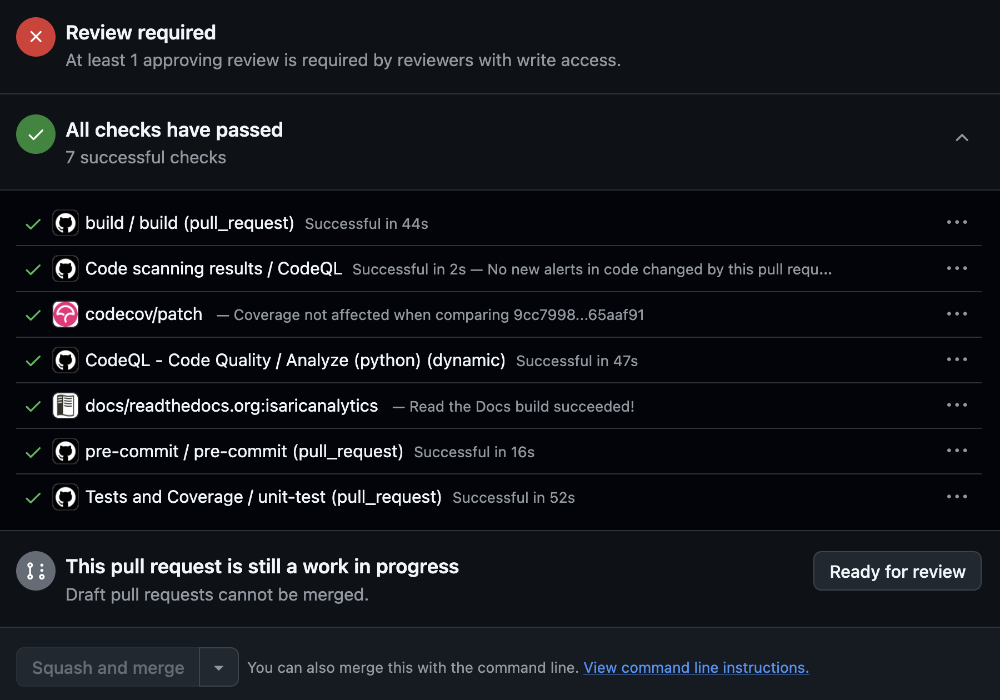
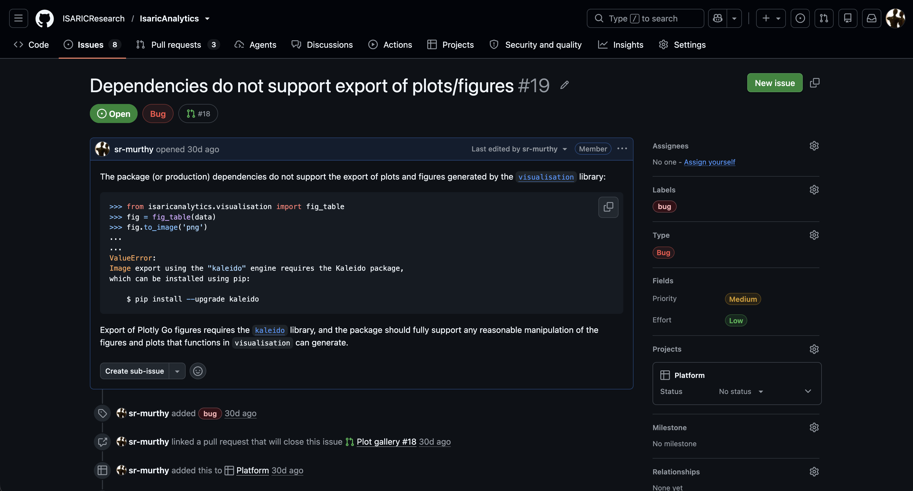

# Contributing

Contributions to this repository include all ([Git](https://git-scm.com/)) version-controlled changes made to one or more files (including documentation files) in the repository, specifically, in the default (`main`) branch of the
repository, as well as [issues](https://github.com/ISARICResearch/IsaricAnalytics/issues),
which count as informal contributions that are external to version control.

Changes should be submitted in the form of a [pull request](https://docs.github.com/en/pull-requests/reference/pull-requests) (PR), which is then reviewed and approved by a repository member with the appropriate level of permission, following which the pull request is merged into the repository and the changes incorporated.

Before submitting pull requests contributors must first:

- Have a copy of the repository as a clone or fork.
- If working with a clone, check you have the right level of access to the repository, which is usually the ability to read from and write to the repository. Access is typically granted by repository maintainers,
  who are [listed](https://github.com/ISARICResearch/IsaricAnalytics/blob/main/README.md#maintainers)
  in the README.

The basic PR-based contributions workflow is described below in very general terms, omitting specifics of any particular tools such as Git, command line shells, IDEs etc. Some familiarity with Git and GitHub is assumed and also useful. As this is independent of the contributions workflow the relevant and appropriate documentation or external learning resources can be consulted.

## Basic PR Workflow

1.  Create a new (local) branch that will contain your changes - usually this will be created from the latest copy of the `main` branch, which is the default branch, but this could be different depending on your requirements.
2.  Push the branch upstream to the GitHub repository (called the **remote**, and usually named `origin` in Git), then [create a PR](https://docs.github.com/en/pull-requests/how-tos/create-pull-requests/creating-a-pull-request) from the upstream branch targeting the `main` branch, and **also mark the PR as a **[draft](https://docs.github.com/en/pull-requests/how-tos/create-pull-requests/changing-the-stage-of-a-pull-request#converting-a-pull-request-to-a-draft) to indicate that it is **under development** (or work in progress).
3.  Once you're satisfied with the changes, **mark the PR as** [ready for review](https://docs.github.com/en/pull-requests/how-tos/create-pull-requests/changing-the-stage-of-a-pull-request#marking-a-pull-request-as-ready-for-review), and [request a review](https://docs.github.com/en/pull-requests/how-tos/create-pull-requests/requesting-a-pull-request-review) from a repository member - one reviewer is sufficient and necessary, and all PRs require a minimum of one approval.
4.  If the PR is approved, merge it yourself if you have the necessary permissions, or, alternatively, request a merge from either the reviewer(s) or another repository member who can merge it.
5.  If there are questions or requested changes from the reviewer these must be addressed - this may require changes to be staged and committed on the local branch in the usual way, before updating the upstream branch (which automatically updates the PR); it may also require PR discussions to be resolved. Request another review and approval if required, and merge the PR as described above.

>[!Note]
A draft PR cannot be merged, which is why it is advisable to mark the PR as a draft while it is still in development. Draft status should be removed only when the PR is ready to be reviewed, as described above.

### PR Status Checks

Contributors should familiarise themselves with a number of automated
[status checks](https://docs.github.com/en/pull-requests/reference/status-checks) (running as GitHub Actions workflows) that are automatically triggered whenever a PR is updated. These are:

- [Pre-commit checks](https://github.com/ISARICResearch/IsaricAnalytics/blob/main/.github/workflows/pre-commit.yml) - mainly code linting.
- [Package builds](https://github.com/ISARICResearch/IsaricAnalytics/blob/main/.github/workflows/build.yml) - package artifact builds (source distribution, Python wheel) and a package import test from the wheel.
- [Unit tests with code coverage checks](https://github.com/ISARICResearch/IsaricAnalytics/blob/main/.github/workflows/test.yml) - running unit tests, and measuring and uploading a code coverage report (to
  [Codecov.io](Codecov.io)).
- [PR patch code coverage checks](https://github.com/ISARICResearch/IsaricAnalytics/blob/main/codecov.yml) - called [patch status](https://docs.codecov.com/docs/commit-status#patch-status), this measures code coverage of the source lines modified in the PR, and is another status check involving [Codecov.io](Codecov.io).
- [CodeQL](https://securitylab.github.com/codeql-wall-of-fame/) code scanning and quality checks.
- PR-specific Read the Docs (RTD) [documentation builds](https://github.com/ISARICResearch/IsaricAnalytics/blob/main/.readthedocs.yaml) - see
  [this](https://github.com/ISARICResearch/IsaricAnalytics/blob/main/CONTRIBUTING.md#documentation-prs) for further information.

### Resolving PR Problems and Keeping the PR Up-to-date

Any **PR problems** such as status check errors, [merge conflicts](https://docs.github.com/en/pull-requests/reference/merge-conflicts),
or other anomalies, should be **investigated** and **resolved**.

Status check errors can be investigated by inspecting the [GitHub Actions workflow logs](https://github.com/ISARICResearch/IsaricAnalytics/actions) for the relevant workflow.

Merge conflicts can be [resolved locally on the command line](https://docs.github.com/en/pull-requests/how-tos/merge-and-close-pull-requests/resolving-a-merge-conflict-using-the-command-line), but this is best done **only if you're familiar with Git**, otherwise please ask a [maintainer](https://github.com/ISARICResearch/IsaricAnalytics/blob/main/README.md#maintainers). Merge conflicts can also be [resolved on
GitHub](https://docs.github.com/en/pull-requests/how-tos/merge-and-close-pull-requestsresolving-a-merge-conflict-on-github). Resolving a merge conflict will always create a new merge commit in the PR branch.

An example screenshot from a PR with all checks passing is given below.



Another point to note is that if the PR's target (or base) branch, usually `main`, is updated (by other PRs or direct commits) while the PR is still in development or review (and is therefore unmerged), you should see a warning on the PR status checks box that it is [out of date and should be updated](https://docs.github.com/en/pull-requests/how-tos/create-pull-requests/keeping-your-pull-request-in-sync-with-the-base-branch). This may sometimes lead to merge conflicts, which must be resolved as described above, before proceeding with further PR changes.

### PR Rules

Contributors should also note some rules that are in place and apply to
all PRs. These are:

- A PR approval is dismissed if it is updated with new commits pushed after that approval - this is to ensure that all current changes are subject to review prior to any approval. For this reason contributors should, if possible, request a review once they're satisfied that all changes are complete.
- An approved PR cannot be merged until all PR discussions/conversations are
  [resolved](https://docs.github.com/en/pull-requests/how-tos/review-pull-requests/commenting-on-a-pull-request#resolving-conversations) - this is to ensure that any lingering questions or issues raised in a discussion have been addressed before merging the PR.

These rules can only be bypassed by an [ISARICResearch GitHub organisation](https://github.com/ISARICResearch) administrator or repository administrator. Please contact a [maintainer](https://github.com/ISARICResearch/IsaricAnalytics/blob/main/README.md#maintainers) for further information.

## Documentation-related PRs

Contributors submitting PRs that include changes in the [documentation
files](https://github.com/ISARICResearch/IsaricAnalytics/tree/main/docs) - should familiarise themselves with the documentation tools (mainly, [Sphinx](https://www.sphinx-doc.org/en/master/index.html)), platforms
([Read the Docs](https://about.readthedocs.com)) and documentation-specific dependencies, used.

The basic PR workflow is the same as described above, but there are some important points to note:

- The development environment should contain, in addition to the package dependencies, also all the documentation-specific dependencies, as listed in the [project
  TOML](https://github.com/ISARICResearch/IsaricAnalytics/blob/main/pyproject.toml#L75), in order to support local building and viewing of the complete documentation site. For dependency management it is recommended to use a modern, fast and accurate package / dependency manager such as [Astral
  UV](https://docs.astral.sh/uv/). In particular, the UV [`sync`](https://docs.astral.sh/uv/concepts/projects/sync/) command is very useful in keeping dependencies in the environment synchronised with the project dependencies.
- To build the complete documentation site locally it is sufficient to run the Sphinx command below from the root of the repository (following which the site will be accessible from `docs/_build/html/index.html`):

```
make -C docs html
```

- On each PR commit there is a complete RTD build of the documentation site that is available from:

```
https://isaricanalytics--n.org.readthedocs.build/en/n/
```

where `n` should be **replaced** by the number of the PR as found in the PR URL. The build usually takes some time (1-2 minutes) before the site is updated.

## Issues

As mentioned in the introduction to this page, [creating GitHub issues](https://github.com/ISARICResearch/IsaricAnalytics/issues) also counts as contributions, but these are external to version control.

Issues can be used to define and discuss features, bugs and other relevant improvements or changes. They can also be linked to PRs. For more information see the [GitHub documentation](https://docs.github.com/en/issues/tracking-your-work-with-issues/learning-about-issues/quickstart).

Issues have settings such as assignees, colour-coded tags/labels, type, project etc. and can be linked to PRs. These appear on the right hand side of the issue page, and it is recommended to apply as many of the relevant settings, especially the setting to link an issue to a relevant PR where possible. Refer to the screenshot below of an actual current issue in this repository.



## Code Hygiene

Code hygiene is an informal notion of good code quality and ways of achieving this through standardised development practices, standards and tools. While there are no formal rules for source code changes some basic principles should be kept in mind:

* Code should be **readable** in terms of being (relatively) easy to follow and understand by others.

* Code formatting and styling, including naming conventions, should be **consistent**, as this not only contributes to readability but makes it easier to identify inconsistencies.

* Code should be **concise** in terms of being simple enough to achieve the task at hand, and not too verbose or overcomplicated.

* Code should be **tested** where possible - if this isn't possible then a follow-up task should be created to add tests.

Contributors are recommended to consider using the following practices:

* Ensure that **pre-commit hooks** are integrated into your development environment so that they are triggered by local commits in the repository. This requires the Python [`pre-commit` dependency](https://github.com/ISARICResearch/IsaricAnalytics/blob/main/pyproject.toml#L66) to be installed. The hooks specific to this repository, which include [Ruff](https://astral.sh/ruff) code **linting**, are defined [here](https://github.com/ISARICResearch/IsaricAnalytics/blob/main/.pre-commit-config.yaml), and can also be triggered manually by running:
```shell
pre-commit run --all-files
```

* Use **docstrings** and **type hints** for all public functions and public class methods in public modules, excluding private (non-public) functions and methods in public modules, and private modules entirely. The recommended docstring style is the [Numpy style](https://numpydoc.readthedocs.io/en/latest/format.html), which uses [reStructuredText](http://docutils.sourceforge.net/rst.html) syntax and is rendered (to HTML) with [Sphinx](https://www.sphinx-doc.org/). Function and method docstrings should contain, at minimum, the following details: a top-level **concise description**, **parameters** (arguments) if present, **return values** if present, **exceptions** if present. [Example snippets](https://numpydoc.readthedocs.io/en/latest/format.html#examples) that can be used for [doctests](https://docs.python.org/3/library/doctest.html) are optional, but should be added if examples are available and easy to reproduce. Any warnings or notes can also be added using the appropriate [reStructuredText directives](https://docutils.sourceforge.io/docs/ref/rst/directives.html). Docstrings should be kept up-to-date with changes in the source code. Refer to the [package libraries](https://github.com/ISARICResearch/IsaricAnalytics/tree/main/isaricanalytics) in this repository, where all public functions and class methods have Numpy docstrings.

* Organise statements in a function or class method into logically meaningful **blocks**, and prefix blocks with meaningful **comments**. Very small functions or methods with too few statements to make this possible, say, with five statements or less, can be ignored, although comments can always be added if they make sense.

* In public modules, lexicographically **list all public members** in the special [`__all__`](https://docs.python.org/3/reference/simple_stmts.html#module.__all__) member. The list should be kept up-to-date with changes in module members. This is already done in all the existing package libraries, so if you're modifying any of their members ensure that the `__all__` list is updated appropriately.

* Use **import styling blocks** in modules to separate imports of (or from) standard libraries, third-party libraries, and internal package libraries, and within each block separate absolute from relative imports in sub-blocks. Imports in all blocks should be lexicographically ordered. The recommended convention, currently followed in the package libraries, is illustrated below with a simple hypothetical example:
```python
# -- IMPORTS --

# -- Standard libraries --
import abc
import babel.core as babel_core
import io
import itertools as it
import string

from datetime import datetime as dt
from pathlib import Path
from types import GeneratorType
from typing import Generator

# -- 3rd party libraries --
import numpy as np
import pandas as pd
import psutil
import scipy.stats

# -- Internal libraries --
import isaricanalytics.utils as utils

from isaricanalytics.redcap_data import (
    convert_onehot_to_binary,
    get_branching_logic_variables,
    harmonise_age,
)
```

* **Order module members** in some meaningful way, for example, lexicographically. In an unordered module with many members, say, upwards of 20, it is harder to locate members. Module member ordering is not currently being applied in the package libraries, but this could easily be done.

* If you're working on a **reusable** function, class method or, generally, some callable, use an **appropriate level of generality**, i.e. a level that is not too general or too specific to the task. There is **no absolute level of generality**, and finding the right level requires a subjective judgment about what is appropriate to the level or scope of reusability. It may be useful to refer to the [SOLID principles](https://en.wikipedia.org/wiki/SOLID) for general guidance, particularly, the [single responsibility principle](https://en.wikipedia.org/wiki/Single-responsibility_principle) as applied to functions and methods, which says that each function or method should do one and only one thing. This recommendation does not apply to code that is task- or problem-specific where reuse isn't possible.

* **Locate new code appropriately**. So, new functions, class methods, or callables (such as classes) should be added to an existing module or library if that makes sense in terms of logically related functionality. Otherwise, a new module, or even a new subpackage, may be more appropriate.
