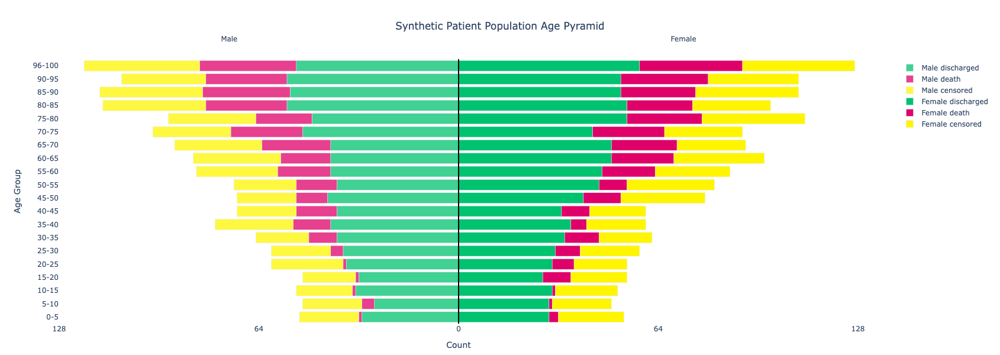

.. _dual-stack-pyramid-plots:

Dual Stack Pyramid Plots
========================

Dual stack pyramid plots are used to construct so-called `population pyramids <https://en.wikipedia.org/wiki/Population_pyramid>`_, which show the distribution of a population by age groups and sex in the form of stacked histogram bars, one bar for each age group. These can be generated using the :py:func:`~isaricanalytics.visualisation.fig_dual_stack_pyramid` function, which returns a :py:class:`Plotly Go Figure <plotly.graph_objs._figure.Figure>` object.

The plot above was generated using a synthetic dataset of patient population distribution by age, sex, and patient outcome. **Click** the image to view the full interactive and fully annotated Plotly Go figure. Here is the synthetic dataset below as a table (which can easily be converted to a CSV).

.. list-table:: Synthetic dataset of a patient population distribution by age group, sex and outcome
   :header-rows: 1
   :widths: auto

   * - Age Group
     - Sex
     - Outcome
     - Number
   * - 0-5
     - Male
     - death
     - 1
   * - 0-5
     - Male
     - censored
     - 19
   * - 0-5
     - Female
     - discharged
     - 29
   * - 0-5
     - Female
     - death
     - 3
   * - 0-5
     - Female
     - censored
     - 21
   * - 5-10
     - Male
     - discharged
     - 27
   * - 5-10
     - Male
     - death
     - 4
   * - 5-10
     - Male
     - censored
     - 19
   * - 5-10
     - Female
     - discharged
     - 29
   * - 5-10
     - Female
     - death
     - 1
   * - 5-10
     - Female
     - censored
     - 19
   * - 10-15
     - Male
     - discharged
     - 33
   * - 10-15
     - Male
     - death
     - 1
   * - 10-15
     - Male
     - censored
     - 18
   * - 10-15
     - Female
     - discharged
     - 30
   * - 10-15
     - Female
     - death
     - 1
   * - 10-15
     - Female
     - censored
     - 20
   * - 15-20
     - Male
     - discharged
     - 32
   * - 15-20
     - Male
     - death
     - 1
   * - 15-20
     - Male
     - censored
     - 17
   * - 15-20
     - Female
     - discharged
     - 27
   * - 15-20
     - Female
     - death
     - 9
   * - 15-20
     - Female
     - censored
     - 18
   * - 20-25
     - Male
     - discharged
     - 36
   * - 20-25
     - Male
     - death
     - 1
   * - 20-25
     - Male
     - censored
     - 23
   * - 20-25
     - Female
     - discharged
     - 30
   * - 20-25
     - Female
     - death
     - 7
   * - 20-25
     - Female
     - censored
     - 17
   * - 25-30
     - Male
     - discharged
     - 37
   * - 25-30
     - Male
     - death
     - 4
   * - 25-30
     - Male
     - censored
     - 19
   * - 25-30
     - Female
     - discharged
     - 31
   * - 25-30
     - Female
     - death
     - 8
   * - 25-30
     - Female
     - censored
     - 19
   * - 30-35
     - Male
     - discharged
     - 39
   * - 30-35
     - Male
     - death
     - 9
   * - 30-35
     - Male
     - censored
     - 17
   * - 30-35
     - Female
     - discharged
     - 34
   * - 30-35
     - Female
     - death
     - 11
   * - 30-35
     - Female
     - censored
     - 17
   * - 35-40
     - Male
     - discharged
     - 41
   * - 35-40
     - Male
     - death
     - 12
   * - 35-40
     - Male
     - censored
     - 25
   * - 35-40
     - Female
     - discharged
     - 36
   * - 35-40
     - Female
     - death
     - 5
   * - 35-40
     - Female
     - censored
     - 19
   * - 40-45
     - Male
     - discharged
     - 39
   * - 40-45
     - Male
     - death
     - 13
   * - 40-45
     - Male
     - censored
     - 19
   * - 40-45
     - Female
     - discharged
     - 33
   * - 40-45
     - Female
     - death
     - 9
   * - 40-45
     - Female
     - censored
     - 18
   * - 45-50
     - Male
     - discharged
     - 42
   * - 45-50
     - Male
     - death
     - 10
   * - 45-50
     - Male
     - censored
     - 19
   * - 45-50
     - Female
     - discharged
     - 40
   * - 45-50
     - Female
     - death
     - 12
   * - 45-50
     - Female
     - censored
     - 27
   * - 50-55
     - Male
     - discharged
     - 39
   * - 50-55
     - Male
     - death
     - 13
   * - 50-55
     - Male
     - censored
     - 20
   * - 50-55
     - Female
     - discharged
     - 45
   * - 50-55
     - Female
     - death
     - 9
   * - 50-55
     - Female
     - censored
     - 28
   * - 55-60
     - Male
     - discharged
     - 41
   * - 55-60
     - Male
     - death
     - 17
   * - 55-60
     - Male
     - censored
     - 26
   * - 55-60
     - Female
     - discharged
     - 46
   * - 55-60
     - Female
     - death
     - 17
   * - 55-60
     - Female
     - censored
     - 24
   * - 60-65
     - Male
     - discharged
     - 41
   * - 60-65
     - Male
     - death
     - 16
   * - 60-65
     - Male
     - censored
     - 28
   * - 60-65
     - Female
     - discharged
     - 49
   * - 60-65
     - Female
     - death
     - 20
   * - 60-65
     - Female
     - censored
     - 29
   * - 65-70
     - Male
     - discharged
     - 41
   * - 65-70
     - Male
     - death
     - 22
   * - 65-70
     - Male
     - censored
     - 28
   * - 65-70
     - Female
     - discharged
     - 49
   * - 65-70
     - Female
     - death
     - 21
   * - 65-70
     - Female
     - censored
     - 22
   * - 70-75
     - Male
     - discharged
     - 50
   * - 70-75
     - Male
     - death
     - 23
   * - 70-75
     - Male
     - censored
     - 25
   * - 70-75
     - Female
     - discharged
     - 43
   * - 70-75
     - Female
     - death
     - 23
   * - 70-75
     - Female
     - censored
     - 25
   * - 75-80
     - Male
     - discharged
     - 47
   * - 75-80
     - Male
     - death
     - 18
   * - 75-80
     - Male
     - censored
     - 28
   * - 75-80
     - Female
     - discharged
     - 54
   * - 75-80
     - Female
     - death
     - 24
   * - 75-80
     - Female
     - censored
     - 33
   * - 80-85
     - Male
     - discharged
     - 55
   * - 80-85
     - Male
     - death
     - 26
   * - 80-85
     - Male
     - censored
     - 33
   * - 80-85
     - Female
     - discharged
     - 54
   * - 80-85
     - Female
     - death
     - 21
   * - 80-85
     - Female
     - censored
     - 25
   * - 85-90
     - Male
     - discharged
     - 54
   * - 85-90
     - Male
     - death
     - 28
   * - 85-90
     - Male
     - censored
     - 33
   * - 85-90
     - Female
     - discharged
     - 52
   * - 85-90
     - Female
     - death
     - 24
   * - 85-90
     - Female
     - censored
     - 33
   * - 90-95
     - Male
     - discharged
     - 55
   * - 90-95
     - Male
     - death
     - 26
   * - 90-95
     - Male
     - censored
     - 27
   * - 90-95
     - Female
     - discharged
     - 52
   * - 90-95
     - Female
     - death
     - 28
   * - 90-95
     - Female
     - censored
     - 29
   * - 96-100
     - Male
     - discharged
     - 52
   * - 96-100
     - Male
     - death
     - 31
   * - 96-100
     - Male
     - censored
     - 37
   * - 96-100
     - Female
     - discharged
     - 58
   * - 96-100
     - Female
     - death
     - 33
   * - 96-100
     - Female
     - censored
     - 36

The :py:func:`~isaricanalytics.visualisation.fig_dual_stack_pyramid` function expects a dataframe with the following columns (in no particular order):

* ``"y_axis"`` - the age group label
* ``"side"`` - the sex
* ``"stack_group"`` - the patient outcome
* ``"value"`` - the number of patients in the category (combination of age group, sex, outcome)
* ``"left_side"`` - a boolean to indicate where the value should appear, with ``1`` indicating left and ``0`` indicating right

Provided your CSV contains these columns and is loaded into a valid Pandas dataframe, here are the Python steps you need to generate the plot above using the plot above, where males are on the left and females are on the right, using the :py:func:`~isaricanalytics.visualisation.fig_dual_stack_pyramid` function:

.. code:: python

   import pandas as pd
   from isaricanalytics.visualisation import fig_dual_stack_pyramid
   # Load the CSV data from a string buffer
   data = pd.read_csv(io.StringIO(
       """
       y_axis,side,stack_group,value,left_side
       0-5,Male,discharged,31,1
       0-5,Male,death,1,1
       0-5,Male,censored,19,1
       0-5,Female,discharged,29,0
       0-5,Female,death,3,0
       0-5,Female,censored,21,0
       5-10,Male,discharged,27,1
       5-10,Male,death,4,1
       5-10,Male,censored,19,1
       5-10,Female,discharged,29,0
       5-10,Female,death,1,0
       5-10,Female,censored,19,0
       10-15,Male,discharged,33,1
       10-15,Male,death,1,1
       10-15,Male,censored,18,1
       10-15,Female,discharged,30,0
       10-15,Female,death,1,0
       10-15,Female,censored,20,0
       15-20,Male,discharged,32,1
       15-20,Male,death,1,1
       15-20,Male,censored,17,1
       15-20,Female,discharged,27,0
       15-20,Female,death,9,0
       15-20,Female,censored,18,0
       20-25,Male,discharged,36,1
       20-25,Male,death,1,1
       20-25,Male,censored,23,1
       20-25,Female,discharged,30,0
       20-25,Female,death,7,0
       20-25,Female,censored,17,0
       25-30,Male,discharged,37,1
       25-30,Male,death,4,1
       25-30,Male,censored,19,1
       25-30,Female,discharged,31,0
       25-30,Female,death,8,0
       25-30,Female,censored,19,0
       30-35,Male,discharged,39,1
       30-35,Male,death,9,1
       30-35,Male,censored,17,1
       30-35,Female,discharged,34,0
       30-35,Female,death,11,0
       30-35,Female,censored,17,0
       35-40,Male,discharged,41,1
       35-40,Male,death,12,1
       35-40,Male,censored,25,1
       35-40,Female,discharged,36,0
       35-40,Female,death,5,0
       35-40,Female,censored,19,0
       40-45,Male,discharged,39,1
       40-45,Male,death,13,1
       40-45,Male,censored,19,1
       40-45,Female,discharged,33,0
       40-45,Female,death,9,0
       40-45,Female,censored,18,0
       45-50,Male,discharged,42,1
       45-50,Male,death,10,1
       45-50,Male,censored,19,1
       45-50,Female,discharged,40,0
       45-50,Female,death,12,0
       45-50,Female,censored,27,0
       50-55,Male,discharged,39,1
       50-55,Male,death,13,1
       50-55,Male,censored,20,1
       50-55,Female,discharged,45,0
       50-55,Female,death,9,0
       50-55,Female,censored,28,0
       55-60,Male,discharged,41,1
       55-60,Male,death,17,1
       55-60,Male,censored,26,1
       55-60,Female,discharged,46,0
       55-60,Female,death,17,0
       55-60,Female,censored,24,0
       60-65,Male,discharged,41,1
       60-65,Male,death,16,1
       60-65,Male,censored,28,1
       60-65,Female,discharged,49,0
       60-65,Female,death,20,0
       60-65,Female,censored,29,0
       65-70,Male,discharged,41,1
       65-70,Male,death,22,1
       65-70,Male,censored,28,1
       65-70,Female,discharged,49,0
       65-70,Female,death,21,0
       65-70,Female,censored,22,0
       70-75,Male,discharged,50,1
       70-75,Male,death,23,1
       70-75,Male,censored,25,1
       70-75,Female,discharged,43,0
       70-75,Female,death,23,0
       70-75,Female,censored,25,0
       75-80,Male,discharged,47,1
       75-80,Male,death,18,1
       75-80,Male,censored,28,1
       75-80,Female,discharged,54,0
       75-80,Female,death,24,0
       75-80,Female,censored,33,0
       80-85,Male,discharged,55,1
       80-85,Male,death,26,1
       80-85,Male,censored,33,1
       80-85,Female,discharged,54,0
       80-85,Female,death,21,0
       80-85,Female,censored,25,0
       85-90,Male,discharged,54,1
       85-90,Male,death,28,1
       85-90,Male,censored,33,1
       85-90,Female,discharged,52,0
       85-90,Female,death,24,0
       85-90,Female,censored,33,0
       90-95,Male,discharged,55,1
       90-95,Male,death,26,1
       90-95,Male,censored,27,1
       90-95,Female,discharged,52,0
       90-95,Female,death,28,0
       90-95,Female,censored,29,0
       96-100,Male,discharged,52,1
       96-100,Male,death,31,1
       96-100,Male,censored,37,1
       96-100,Female,discharged,58,0
       96-100,Female,death,33,0
       96-100,Female,censored,36,0
       """
   ), skipinitialspace=True)
   fig = fig_dual_stack_pyramid(
      data=data,
      title="Synthetic Patient Population Age Pyramid",
      xlabel="Count",
      ylabel="Age Group",
      base_color_map={
          "discharged": "#00c26f",
          "death": "#df0069",
          "censored": "#fff500"
      },
      height=430
   )
   fig.show()

You should see the plot appearing as given above.

.. note::

   The ``base_color_map`` dictionary defines the colours of the patient outcome subgroups for males and females in each age group, and this can be customised.
