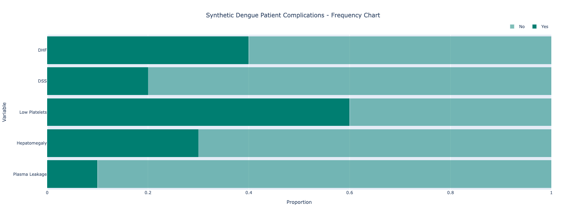

.. _frequency-plots:

Frequency Plots
===============

Frequency plots/charts refer to `stacked horizontal bar charts <https://en.wikipedia.org/wiki/Bar_chart#Stacked_bar_chart>`_, which show frequency distribution of data across labelled and segmented subgroups, with segment widths representing the proportion or frequency of the subgroup. These can be generated using the :py:func:`~isaricanalytics.visualisation.fig_frequency_chart` function, which returns a :py:class:`Plotly Go Figure <plotly.graph_objs._figure.Figure>` object.

The plot above was generated using a synthetic dataset of patient treatment complications for Dengue, consisting of ten patients and five complications. **Click** the image to view the full interactive and fully annotated Plotly Go figure. Here is the synthetic dataset below as a table (which can easily be converted to a CSV).

.. list-table:: Synthetic dataset for Dengue patient treatment complications
   :header-rows: 1
   :widths: auto

   * - Subgroup Label / Outcome Variable
     - Description / Short Label
     - Frequency
   * - Dengue Haemorrhagic Fever
     - DHF
     - 0.4
   * - Dengue Shock Syndrome
     - DSS
     - 0.2
   * - Thrombocytopenia
     - Low Platelets
     - 0.6
   * - Hepatomegaly
     - Hepatomegaly
     - 0.3
   * - Plasma Leakage
     - Plasma Leakage
     - 0.1

The :py:func:`~isaricanalytics.visualisation.fig_frequency_chart` function expects a dataframe with the following columns (in no particular order):

* ``"label"`` - the subgroup label / outcome variable column of the table
* ``"short_label"`` - the description column of the table
* ``"proportion"`` - the frequency column of the table

Provided your CSV contains these columns and is loaded into a valid Pandas dataframe, here are the Python steps you need to generate the plot above using the :py:func:`~isaricanalytics.visualisation.fig_frequency_chart` function:

.. code:: python

   import pandas as pd
   from isaricanalytics.visualisation import fig_sunburst
   # Load the CSV data from a string buffer
   data = pd.read_csv(io.StringIO(
       """label,short_label,proportion\n
          Dengue Heamorrhagic Fever,DHF,0.4\n
          Dengue Shock Syndrome,DSS,0.2\n
          Thrombocytopenia,Low Platelets,0.6\n
          Hepatomegaly,Hepatomegaly,0.3\n
          Plasma Leakage,Plasma Leakage,0.1\n
	   """
   ), skipinitialspace=True)
   # Create and display the figure
   fig = fig_frequency_chart(
       data,
       title="Synthetic Dengue Patient Complications - Frequency Chart",
       height=350
   )
   fig.show()

You should see the plot appearing as given above.
