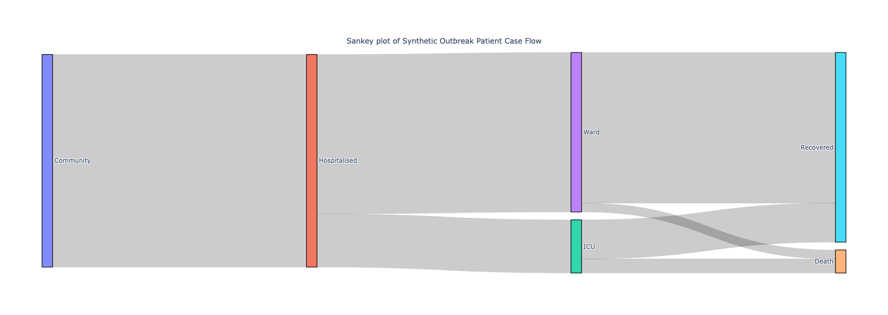

.. _sankey-plots:

Sankey Plots
============

Sankey plots (often called `Sankey diagrams <https://en.wikipedia.org/wiki/Sankey_diagram>`_) can be generated using the :py:func:`~isaricanalytics.visualisation.fig_sankey` function, which returns a :py:class:`Plotly Go Figure <plotly.graph_objs._figure.Figure>` object.

The plot above was generated using a synthetic dataset for a hypothetical community of 1200 people who are hospitalised. **Click** the image to view the full interactive and fully annotated Plotly Go figure.

The synthetic dataset used for this plot is given as a table (which can easily be converted to a CSV).

.. list-table:: Synthetic dataset for a disease outbreak response in a small community
   :widths: 33 33 33
   :header-rows: 1

   * - Source
     - Target
     - Value
   * - Community
     - Hospitalised
     - 1200
   * - Hospitalised
     - ICU
     - 300
   * - Hospitalised
     - Ward
     - 900
   * - ICU
     - Death
     - 80
   * - ICU
     - Recovered
     - 220
   * - Ward
     - Recovered
     - 850
   * - Ward
     - Death
     - 50

The data source can be in any appropriate form, such as, typically, a CSV. Here are the Python steps you need to generate the plot using the :py:func:`~isaricanalytics.visualisation.fig_sankey` function:

.. code:: python

   import pandas as pd
   from isaricanalytics.visualisation import fig_sankey
   # Load the CSV data from a string buffer
   data = pd.read_csv(io.StringIO(
       """source,target,value\n
          Community,Hospitalised,1200\n
          Hospitalised,ICU,300\n
          Hospitalised,Ward,900\n
          ICU,Death,80\n
          ICU,Recovered,220\n
          Ward,Recovered,850\n
          Ward,Death,50"""
   ), skipinitialspace=True)

   # Create the labels, nodes, flows/arrows and annotations
   labels = pd.Series(pd.unique(data[["source", "target"]].values.ravel()))
   nodes = pd.DataFrame({
       "label": labels,
       "customdata": labels.apply(lambda x: f"{x} (synthetic)")
   })
   label_to_idx = {label: i for i, label in enumerate(labels)}
   arrows = pd.DataFrame({
       "source": data["source"].map(label_to_idx),
       "target": data["target"].map(label_to_idx),
       "value": data["value"],
       "customdata": data.apply(lambda r: f"{r['source']} → {r['target']}: {r['value']} cases", axis=1)
   })
   annotations = pd.DataFrame([{
       "text": "Sankey plot of Synthetic Outbreak Patient Case Flow",
       "x": 0.5,
       "y": 1.08,
       "xref": "paper",
       "yref": "paper",
       "showarrow": False,
       "font": {"size": 14}
   }])
   fig = fig_sankey(
    [nodes, arrows, annotations],
    height=600
   )
   fig.show()

You should see the plot appearing as given above.

.. note::

   Any dataframe or CSV column names, or dictionary field labels, in the example
   above that are not specific to the dataset must be as given, otherwise the
   function may throw an exception or return an incorrect figure.

   Also, the ``height`` parameter, which is optional with a default of ``430``,
   can be used to customise the plot height. Refer to the
   :py:func:`~isaricanalytics.visualisation.fig_sankey` function
   docstring for more information.
