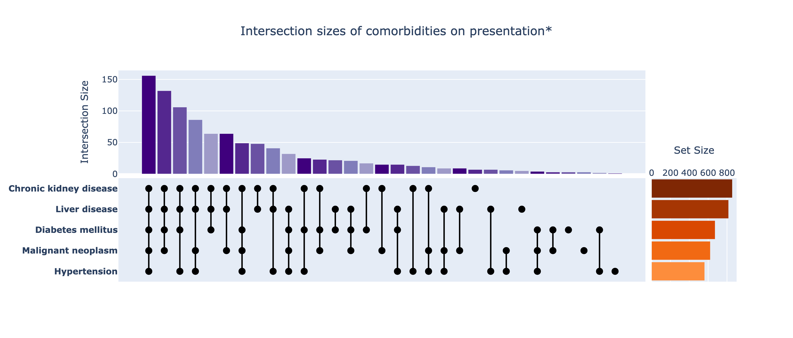

.. _upset-plots:

Upset Plots
===========

`Upset plots <https://en.wikipedia.org/wiki/UpSet_plot>`_ can be generated using the :py:func:`~isaricanalytics.visualisation.fig_upset` function, which returns a :py:class:`Plotly Go Figure <plotly.graph_objs._figure.Figure>` object.

The plot above was generated using a synthetic dataset of patient treatment complications for Dengue, consisting of five complications and their patient counts, as well counts for the intersections (conjoint occurrences) of the complication subsets. **Click** the image to view the full interactive and fully annotated Plotly Go figure.

The sythetic dataset used for this plot is given below in the form of two tables (which can easily be converted to CSVs), the first showing the individual complications and their patient counts:

.. list-table:: Synthetic dataset of Dengue patient treatment complications - patient counts
   :header-rows: 1
   :widths: auto

   * - Complication
     - Patient Count
   * - Shock
     - 891
   * - Meningitis
     - 781
   * - Acute renal injury / acute renal failure
     - 757
   * - Cardiac arrest
     - 709
   * - Focal neurological signs
     - 702

and the second showing the intersections between these subsets:

.. list-table:: Synthetic dataset of Dengue patient treatment complications - intersection counts
   :header-rows: 1
   :widths: auto

   * - Complication Intersections
     - Patient Count
   * - Shock, Meningitis, Acute renal injury / acute renal failure, Cardiac arrest, Focal neurological signs
     - 256
   * - Shock, Meningitis, Acute renal injury / acute renal failure, Cardiac arrest
     - 121
   * - Shock, Meningitis, Acute renal injury / acute renal failure, Focal neurological signs
     - 115
   * - Shock, Meningitis, Cardiac arrest, Focal neurological signs
     - 86
   * - Shock, Acute renal injury / acute renal failure, Cardiac arrest, Focal neurological signs
     - 67
   * - Shock, Meningitis, Focal neurological signs
     - 37
   * - Shock, Acute renal injury / acute renal failure, Cardiac arrest
     - 37
   * - Shock, Acute renal injury / acute renal failure, Focal neurological signs
     - 34
   * - Shock, Meningitis, Cardiac arrest
     - 31
   * - Shock, Meningitis, Acute renal injury / acute renal failure
     - 30
   * - Meningitis, Acute renal injury / acute renal failure, Cardiac arrest, Focal neurological signs
     - 30
   * - Shock, Cardiac arrest, Focal neurological signs
     - 26
   * - Meningitis, Acute renal injury / acute renal failure, Focal neurological signs
     - 18
   * - Shock, Meningitis
     - 15
   * - Meningitis, Acute renal injury / acute renal failure, Cardiac arrest
     - 15
   * - Shock, Acute renal injury / acute renal failure
     - 14
   * - Shock, Cardiac arrest
     - 11
   * - Shock, Focal neurological signs
     - 9
   * - Meningitis, Cardiac arrest, Focal neurological signs
     - 8
   * - Meningitis, Acute renal injury / acute renal failure
     - 7
   * - Meningitis, Cardiac arrest
     - 6
   * - Acute renal injury / acute renal failure, Cardiac arrest, Focal neurological signs
     - 6
   * - Acute renal injury / acute renal failure, Cardiac arrest
     - 5
   * - Meningitis, Focal neurological signs
     - 3
   * - Meningitis,
     - 3
   * - Cardiac arrest, Focal neurological signs
     - 3
   * - Shock,
     - 2
   * - Acute renal injury / acute renal failure, Focal neurological signs
     - 2
   * - Focal neurological signs,
     - 2
   * - Cardiac arrest,
     - 1

The :py:func:`~isaricanalytics.visualisation.fig_upset` function expects these tables in the form of **a pair** of two dataframes, the first dataframe containing the complication counts data with the following columns (in no particular order):

* ``"index"`` - a label internal to the function denoting the complication, and prefixed with ``"compl"``, e.g. ``"compl_shock"`` for shock, ``"compl_meningitis"`` for meningitis, ``"compl_acuterenal"`` for acute renal injury / failre etc.
* ``"label"`` - a descriptive label for the complication
* ``"short_label"`` - a more concise descriptive label for the complication, which could be the same as the value of ``"label"``
* ``"count"`` - the complication count

and the second dataframe containing the complication intersection data with the following columns (in no particular order):

* ``"index"`` - a string form of a tuple of the labels described above for the complications, e.g. ``"('compl_shock', 'compl_meningitis', 'compl_acuterenal', 'compl_cardiarrest', 'compl_focalneuro')"`` for the intersection of shock, meningitis, acute renal injury / failure, cardiac arrest, focal neurological signs.
* ``"label"`` - a string form of the descriptive labels associated with the complications, e.g. ``"('Shock ', 'Meningitis', 'Acute renal injury / acute renal failure', 'Cardiac arrest', 'Focal neurological signs')"``
* ``"count"`` - the complication intersection count

The data source(s) can be in any appropriate form, such as, typically, CSVs. Here are the Python steps you need to generate the plot above using the :py:func:`~isaricanalytics.visualisation.fig_upset` function:

.. code:: python

   import pandas as pd
   from isaricanalytics.visualisation import fig_upset
   # Load the CSV data from a string buffer
   counts = pd.read_csv(io.StringIO(
       """index,count,short_label,label\n
          compl_shock,891,Shock ,Shock \n
          compl_meningitis,781,Meningitis,Meningitis\n
          compl_acuterenal,757,Acute renal injury / acute renal failure,Acute renal injury / acute renal failure\n
          compl_cardiarrest,709,Cardiac arrest,Cardiac arrest\n
          compl_focalneuro,702,Focal neurological signs,Focal neurological signs\n
       """
   ), skipinitialspace=True)
   intersections = pd.read_csv(io.StringIO(
       """
       index,label,count
       "('compl_shock', 'compl_meningitis', 'compl_acuterenal', 'compl_cardiarrest', 'compl_focalneuro')","('Shock ', 'Meningitis', 'Acute renal injury / acute renal failure', 'Cardiac arrest', 'Focal neurological signs')",256
       "('compl_shock', 'compl_meningitis', 'compl_acuterenal', 'compl_cardiarrest')","('Shock ', 'Meningitis', 'Acute renal injury / acute renal failure', 'Cardiac arrest')",121
       "('compl_shock', 'compl_meningitis', 'compl_acuterenal', 'compl_focalneuro')","('Shock ', 'Meningitis', 'Acute renal injury / acute renal failure', 'Focal neurological signs')",115
       "('compl_shock', 'compl_meningitis', 'compl_cardiarrest', 'compl_focalneuro')","('Shock ', 'Meningitis', 'Cardiac arrest', 'Focal neurological signs')",86
       "('compl_shock', 'compl_acuterenal', 'compl_cardiarrest', 'compl_focalneuro')","('Shock ', 'Acute renal injury / acute renal failure', 'Cardiac arrest', 'Focal neurological signs')",67
       "('compl_shock', 'compl_meningitis', 'compl_focalneuro')","('Shock ', 'Meningitis', 'Focal neurological signs')",37
       "('compl_shock', 'compl_acuterenal', 'compl_cardiarrest')","('Shock ', 'Acute renal injury / acute renal failure', 'Cardiac arrest')",37
       "('compl_shock', 'compl_acuterenal', 'compl_focalneuro')","('Shock ', 'Acute renal injury / acute renal failure', 'Focal neurological signs')",34
       "('compl_shock', 'compl_meningitis', 'compl_cardiarrest')","('Shock ', 'Meningitis', 'Cardiac arrest')",31
       "('compl_shock', 'compl_meningitis', 'compl_acuterenal')","('Shock ', 'Meningitis', 'Acute renal injury / acute renal failure')",30
       "('compl_meningitis', 'compl_acuterenal', 'compl_cardiarrest', 'compl_focalneuro')","('Meningitis', 'Acute renal injury / acute renal failure', 'Cardiac arrest', 'Focal neurological signs')",30
       "('compl_shock', 'compl_cardiarrest', 'compl_focalneuro')","('Shock ', 'Cardiac arrest', 'Focal neurological signs')",26
       "('compl_meningitis', 'compl_acuterenal', 'compl_focalneuro')","('Meningitis', 'Acute renal injury / acute renal failure', 'Focal neurological signs')",18
       "('compl_shock', 'compl_meningitis')","('Shock ', 'Meningitis')",15
       "('compl_meningitis', 'compl_acuterenal', 'compl_cardiarrest')","('Meningitis', 'Acute renal injury / acute renal failure', 'Cardiac arrest')",15
       "('compl_shock', 'compl_acuterenal')","('Shock ', 'Acute renal injury / acute renal failure')",14
       "('compl_shock', 'compl_cardiarrest')","('Shock ', 'Cardiac arrest')",11
       "('compl_shock', 'compl_focalneuro')","('Shock ', 'Focal neurological signs')",9
       "('compl_meningitis', 'compl_cardiarrest', 'compl_focalneuro')","('Meningitis', 'Cardiac arrest', 'Focal neurological signs')",8
       "('compl_meningitis', 'compl_acuterenal')","('Meningitis', 'Acute renal injury / acute renal failure')",7
       "('compl_meningitis', 'compl_cardiarrest')","('Meningitis', 'Cardiac arrest')",6
       "('compl_acuterenal', 'compl_cardiarrest', 'compl_focalneuro')","('Acute renal injury / acute renal failure', 'Cardiac arrest', 'Focal neurological signs')",6
       "('compl_acuterenal', 'compl_cardiarrest')","('Acute renal injury / acute renal failure', 'Cardiac arrest')",5
       "('compl_meningitis', 'compl_focalneuro')","('Meningitis', 'Focal neurological signs')",3
       "('compl_meningitis',)","('Meningitis',)",3
       "('compl_cardiarrest', 'compl_focalneuro')","('Cardiac arrest', 'Focal neurological signs')",3
       "('compl_shock',)","('Shock ',)",2
       "('compl_acuterenal', 'compl_focalneuro')","('Acute renal injury / acute renal failure', 'Focal neurological signs')",2
       "('compl_focalneuro',)","('Focal neurological signs',)",2
       "('compl_cardiarrest',)","('Cardiac arrest',)",1
       """
   ))
   # Create and display the figure
   fig = fig_upset(
       (counts, intersections),
       title="Upset Plot of Synthetic Dengue Patient Treatment Complications",
       height=480
   )
   fig.show()

You should see the plot appearing as given above.

.. note::

   Note that the counts and intersections dataframes are provided in a :py:class:`tuple` object.

.. note::

   Any dataframe or CSV column names, or dictionary field labels, in the example
   above that are not specific to the dataset must be as given, otherwise the
   function may throw an exception or return an incorrect figure.

   Also, the ``height`` parameter, which is optional with a default of ``480``,
   can be used to customise the plot height. Refer to the
   :py:func:`~isaricanalytics.visualisation.fig_upset` function
   docstring for more information.
